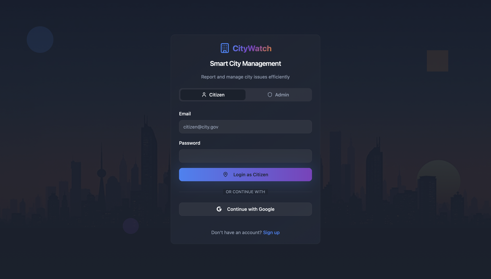
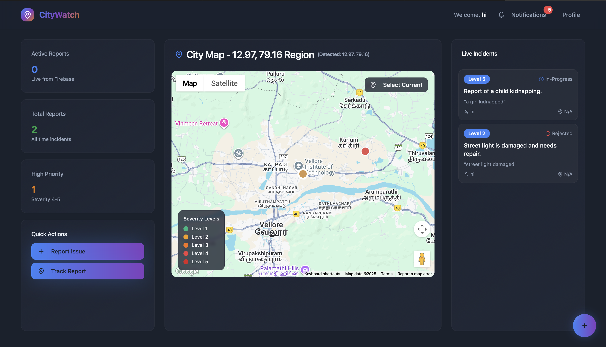
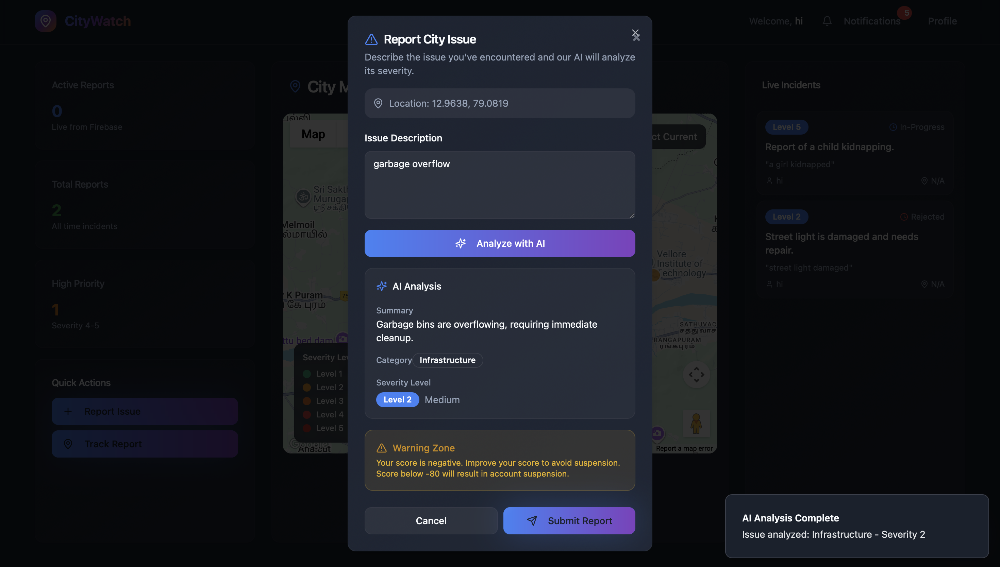
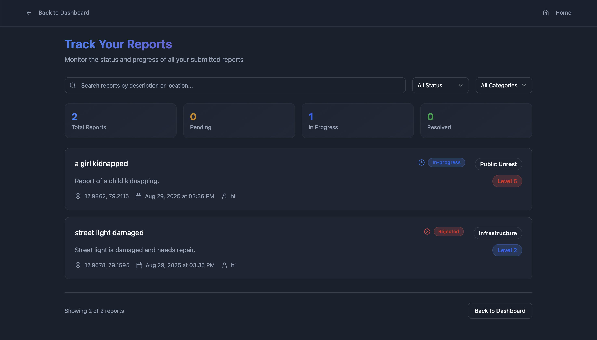
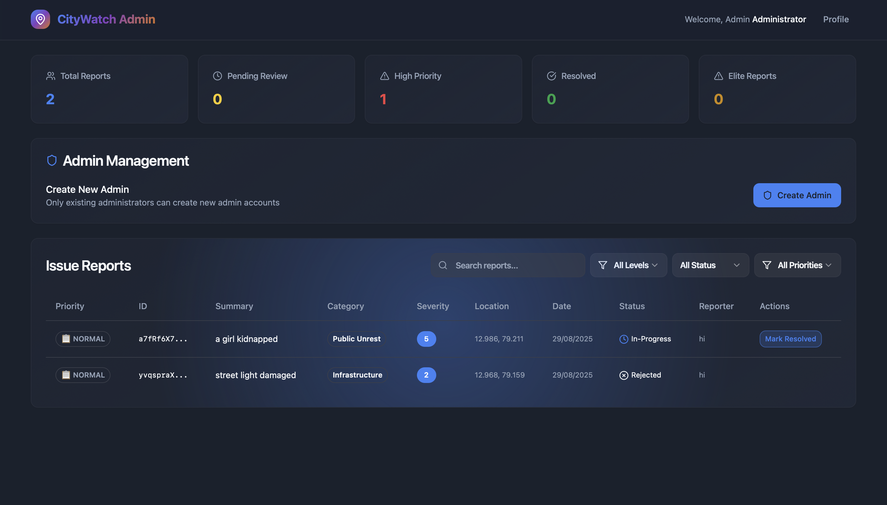

# 🏙️ CityWatch - Smart City Issue Management System

A modern, AI-powered city management platform that enables citizens to report city issues and administrators to manage them efficiently. Built with React, TypeScript, Firebase, and AI integration.


## 🚀 Live Demo

**🌐 Production URL**: [https://pulseai-blr.web.app/](https://pulseai-blr.web.app/)

## 👑 **Admin Access (For Testing)**

**Default Administrator Account:**
- **📧 Email**: `admin@gmail.com`
- **🔑 Password**: `admin@123`
- **👑 Role**: System Administrator
- **🆔 UID**: `kumm2IcgXxNTd2gLC6UxBgwZUEe2`
- **🔐 Permissions**: Full admin access (read, write, delete, admin)

> **💡 Use these credentials to test the admin dashboard and incident management features.**

## ✨ Features

### 🎯 Core Functionality
- **🔐 Firebase Authentication**: Google Auth + Email/Password login
- **📍 Real-time Incident Reporting**: Citizens can report city issues with GPS location
- **🤖 AI-Powered Analysis**: Automatic severity assessment and categorization using Gemini AI
- **📊 Live Dashboard**: Real-time updates of all reported incidents
- **👨‍💼 Admin Panel**: Complete incident management with filtering and status updates
- **🔔 Auto-notifications**: Automatic alerts for high-severity incidents

### 🛠️ Technical Features
- **⚛️ Modern UI**: Built with TailwindCSS + shadcn/ui components
- **⚡ Real-time Updates**: Firestore real-time listeners for live data
- **🔒 TypeScript**: Full type safety throughout the application
- **📱 Responsive Design**: Mobile-first approach with beautiful animations
- **☁️ Cloud Functions**: AI analysis handled by Firebase Cloud Functions

## 🏗️ Architecture

### Frontend (React + TypeScript)
- **📄 Pages**: Login, Dashboard, Admin Dashboard, Track Reports
- **🧩 Components**: MapView, ReportIssueModal, IncidentsList, NotificationBell
- **🔧 Services**: Firebase authentication, incident management, AI integration
- **🎨 Styling**: TailwindCSS with custom city-themed design system

### Backend (Firebase)
- **🔐 Authentication**: Firebase Auth with Google + Email/Password
- **🗄️ Database**: Firestore with real-time listeners
- **⚡ Cloud Functions**: AI analysis using Gemini API
- **🌐 Hosting**: Firebase Hosting for production deployment

## 🚀 Quick Start Guide

### 📋 Prerequisites
- **Node.js** (version 18 or higher)
- **npm** (comes with Node.js)
- **Git** (for cloning the repository)
- **Firebase CLI** (we'll install this during setup)

### 🔧 Step-by-Step Setup

#### Step 1: Navigate to Project Directory
```bash
cd frontend
```

#### Step 2: Install Dependencies
```bash
npm install
```

**Expected Output:**
```
added 1234 packages, and audited 1234 packages in 1m 23s
found 0 vulnerabilities
```

#### Step 3: Install Firebase CLI
```bash
npm install -g firebase-tools
```

#### Step 4: Login to Firebase
```bash
firebase login
```

This will open your browser. Sign in with your Google account that has access to the Firebase project.

#### Step 5: Initialize Firebase Project
```bash
firebase init
```

**Select the following options:**
- **Which Firebase features do you want to set up?**
  - ✅ Firestore: Configure security rules and indexes
  - ✅ Functions: Configure a Cloud Functions directory
  - ✅ Hosting: Configure files for Firebase Hosting

- **Please select an option:**
  - Use an existing project

- **Select a default Firebase project for this directory:**
  - Choose your project (pulseai-blr)

- **What language would you like to use to write Cloud Functions?**
  - JavaScript

- **Do you want to use ESLint to catch probable bugs and enforce style?**
  - No

- **Do you want to install dependencies with npm now?**
  - Yes

- **What do you want to use as your public directory?**
  - dist

- **Configure as a single-page app (rewrite all urls to /index.html)?**
  - Yes

- **Set up automatic builds and deploys with GitHub?**
  - No

- **File dist/index.html already exists. Overwrite?**
  - No

#### Step 6: Set Up Cloud Functions
```bash
cd functions
npm install
```

#### Step 7: Deploy Development Functions
```bash
npm run deploy:dev
```

**Expected Output:**
```
✔  functions[analyzeIncident(us-central1)] Successful create operation.
```

#### Step 8: Return to Frontend Directory
```bash
cd ..
```

#### Step 9: Start Development Server
```bash
npm run dev
```

**Expected Output:**
```
  VITE v5.4.19  ready in 199 ms

  ➜  Local:   http://localhost:8080/
  ➜  Network: http://172.17.71.1:8080/
  ➜  press h + enter to show help
```

#### Step 10: Open Your Browser
Navigate to: **http://localhost:8080**

## 📱 Application Screenshots

### 🔐 Login/Authentication


### 🗺️ Main Dashboard with Map


### 📝 Issue Reporting Modal


### 📊 Incidents List View


### 👨‍💼 Admin Dashboard



## 🎯 How It Works

### 1. **Citizen Experience**
- **Login**: Use Google Auth or email/password
- **Map View**: Click anywhere on the map to select location
- **Report Issue**: Describe the problem and submit
- **AI Analysis**: Wait 30 seconds for automatic severity assessment
- **Live Updates**: See real-time updates of all incidents

### 2. **AI Analysis Process**
- **Input**: Incident description and location
- **Processing**: Gemini AI analyzes the text
- **Output**: Severity level (1-5) and category
- **Storage**: Results saved to Firestore

### 3. **Admin Management**
- **Login**: Use admin credentials (admin@gmail.com / admin@123)
- **Monitor**: View all reported incidents with live updates
- **Filter**: Search by severity, status, or text
- **Manage**: Approve, reject, or mark incidents as complete
- **Alerts**: Automatic notifications for severity 5 incidents

## 🔧 Development

### Available Scripts
```bash
npm run dev          # Start development server
npm run build        # Build for production
npm run build:dev    # Build for development
npm run lint         # Run ESLint
npm run preview      # Preview production build
```

### Project Structure
```
frontend/
├── src/
│   ├── components/          # Reusable UI components
│   │   ├── ui/             # shadcn/ui components
│   │   ├── MapView.tsx     # Interactive map component
│   │   ├── ReportIssueModal.tsx # Issue reporting modal
│   │   ├── IncidentsList.tsx    # Incidents display
│   │   └── AdminDashboard.tsx   # Admin interface
│   ├── pages/              # Main application pages
│   ├── lib/                # Firebase services and utilities
│   ├── hooks/              # Custom React hooks
│   ├── contexts/           # React contexts (Auth)
│   ├── types/              # TypeScript type definitions
│   └── assets/             # Images and static files
├── functions/              # Firebase Cloud Functions
├── public/                 # Static assets
├── firebase.json          # Firebase configuration
├── firestore.rules        # Database security rules
└── firestore.indexes.json # Database indexes
```

### Key Components
- **MapView**: Interactive map with incident markers using Google Maps
- **ReportIssueModal**: Issue reporting with location selection and form validation
- **IncidentsList**: Real-time incidents display with filtering
- **AdminDashboard**: Complete incident management interface
- **NotificationBell**: Real-time notification system
- **ProfilePopup**: User profile and settings management

### Firebase Services
- **authService**: Authentication (Google + Email/Password)
- **incidentService**: Incident CRUD operations
- **aiService**: AI analysis integration
- **firebaseServices**: Core Firebase configuration

## 🚀 Deployment

### Build for Production
```bash
npm run build
```

### Deploy to Firebase
```bash
# Deploy everything
firebase deploy

# Or deploy specific services
firebase deploy --only hosting
firebase deploy --only functions
firebase deploy --only firestore
```

### Environment Variables for Production
Ensure all environment variables are properly set in your Firebase project settings.

## 🔒 Security

- **🔐 Authentication Required**: All routes require valid Firebase auth
- **👥 Role-based Access**: Admin functions restricted to authenticated users
- **🛡️ Firestore Rules**: Secure database access with proper permissions
- **🔑 API Key Protection**: Gemini API key stored as Firebase secret
- **🌐 CORS Protection**: Proper CORS configuration for API endpoints

## 🧪 Testing

### Manual Testing Checklist
- [ ] User authentication (Google + Email/Password)
- [ ] Admin login (admin@gmail.com / admin@123)
- [ ] Incident reporting with location selection
- [ ] AI analysis and severity assessment
- [ ] Real-time updates on dashboard
- [ ] Admin incident management
- [ ] Mobile responsiveness
- [ ] Form validation and error handling

## 🤝 Contributing

1. **Fork** the repository
2. **Create** a feature branch (`git checkout -b feature/amazing-feature`)
3. **Make** your changes
4. **Test** thoroughly
5. **Commit** your changes (`git commit -m 'Add amazing feature'`)
6. **Push** to the branch (`git push origin feature/amazing-feature`)
7. **Submit** a pull request

### Development Guidelines
- Follow TypeScript best practices
- Use shadcn/ui components for consistency
- Ensure mobile responsiveness
- Write meaningful commit messages
- Test on multiple devices and browsers

## 📄 License

This project is licensed under the MIT License - see the [LICENSE](LICENSE) file for details.

## 🆘 Support & Troubleshooting

### Common Issues

#### 1. **Firebase Connection Issues**
```bash
# Check Firebase configuration
firebase projects:list
firebase use your-project-id
```

#### 2. **Port Already in Use**
```bash
# Kill process on port 8080
lsof -ti:8080 | xargs kill -9
```

#### 3. **Environment Variables Not Loading**
- Ensure `.env.local` file exists in frontend directory
- Restart development server after adding variables
- Check variable names match exactly

#### 4. **AI Functions Not Working**
```bash
# Check function logs
firebase functions:log

# Redeploy functions
cd functions && npm run deploy:dev
```

#### 5. **Admin Access Issues**
- Verify admin credentials: admin@gmail.com / admin@123
- Check if user exists in Firebase Auth
- Verify admin role in Firestore users collection

### Getting Help
- **📚 Documentation**: Check Firebase and Gemini API docs
- **🐛 Issues**: Open an issue in the repository
- **💬 Community**: Join Firebase community forums

## 🔮 Future Enhancements

- [ ] **Push Notifications**: Real-time mobile notifications
- [ ] **Image Upload**: Photo evidence for incidents
- [ ] **Analytics Dashboard**: Advanced reporting and insights
- [ ] **Mobile App**: Native iOS/Android applications
- [ ] **Integration APIs**: Connect with city services
- [ ] **Machine Learning**: Predictive incident analysis

## 🙏 Acknowledgments

- **Firebase Team** for the robust backend platform
- **shadcn/ui** for the beautiful component library
- **Google Maps** for location services
- **Gemini AI** for intelligent analysis capabilities
- **TailwindCSS** for the utility-first CSS framework

---

**Built with ❤️ using React, Firebase, and AI**


